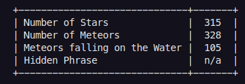
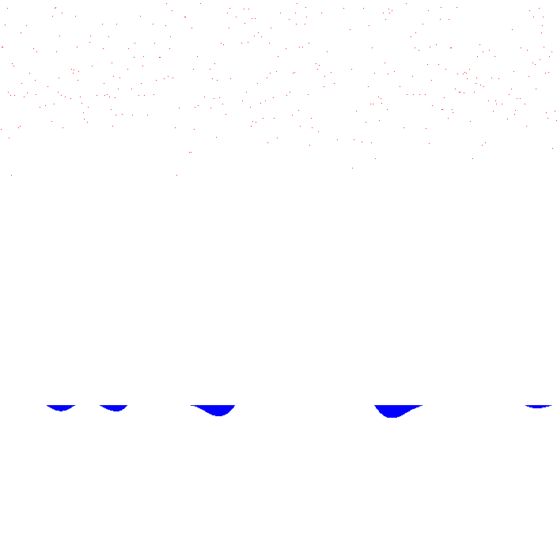

# Solution Comentary

A imagem é uma imagem simples, com pixels de cores contanstes e com alto contraste entre eles.

A ideia principal para resolver as 3 primeiras task foi a mesma:
- *separar apenas o que é relevante em uma imagem com fundo branco*
- contar tudo o que não for branco.

Para tal, utilizei o básico da manipualação de imagem, pedindo para `openCV` abrir os dados da imagem como uma matriz e manipular cada index dessa matriz.

De forma simples, uma imagem é compreendida pelo computador como:
`[posicaoY][posicaoX][RGB]`

portanto, ao analizar cada indice da matriz eu estou, de fato, analizando o valor RGB de cada pixel.

Os resultados encontrados foram:

## task 1 - Count the number of Stars

> Count the number of Stars

As estrelas são representadas pela cor branca, RGB(255, 255, 255)

Essa task foi resolvida com duas etapas:
-  varrer a imagem original e para cada pixel que não for branco, pinta-lo de branco e para cada pixel que for branco, pinta-lo de preto
  - Essa etapa me resulta em uma imagem de fundo branco com todas as estrelas em preto
  - 
- Varrer a imagem produzina na etapa 1 e contar cada pixel preto na imagem.

## task 2 - Count the number of Meteors

> Count the number of Meteors

As estrelas são representadas pela cor vermelha, RGB(255, 0, 0)

Essa task foi resolvida com duas etapas:
-  varrer a imagem original e para cada pixel que não for vermelho ou azul, pinta-lo de branco.
  - Essa etapa me resulta em uma imagem de fundo branco com todas os meteoros em preto.
  - 
- Varrer a imagem produzida na etapa 1 e contar cada pixel vermelho na imagem.

## Extra Step on Task 1 and 2 - meteor/star fill

Para não repetir a contagem de uma estrela ou metoro caso o mesmo fosse maior que um pixel, (fazendo com que 1 estrela fosse contada várias vezes). Assim que uma estrela/meteoro era encontrado, foi aplciado uma função recursiva que pinta tudo que não é branco nos vizinhos em x e vizinhos em y do pixel encontrado, para branco.

UPDATE: Porém, utilizando essa logica o resultado fica menor do que o resultado esperado para o desafío, fazendo com que esta parte do programa tenha sido descartada.

## Task 3 - Meteor on Water

> If the Meteors are falling perpendicularly to the Ground (Water level), count how many will fall on the Water

Para essa etapa, o codigo da `task2` foi reescrito para que seja contado os meteoros por coluna, ao invez de linha.
- Conta a quantidade de meteoro em cada Coluna
Ao fim do loop:
- Caso a coluna tenha um pixel azul (do rio) soma a quantidade da coluna para a quantidade total de meteoro **e quantidade de meteoro na agua**
- caso a coluna *nao* tenha um pixel azul, soma a quantidade da coluna apeans para a quantidade total de meteoro

## Task 4 - Read Text

> (optional) Find the phrase that is hidden in the dots in the sky. 
>   - HINT 1: 177 Characters
>   - HINT 2: Most of the last tasks’ code can be reused for this one

A principio eu achei que poderia haver um texto escrito e escondido com a layer de opacidade

escrevi um código para varrer a imagem e tudo que tivesse opacidade 100% ficasse branco e tudo com opacidade abaixo de 255 ficasse preto, e, conforme podemos ver na imagem, nada apareceu:

Apos isto, pensei que fosse um `connect the dots` e escrevi um códiigo para deixar em uma mesma imagem, todas as estrelas e os meteros, como podemos ver abaixo:

Infelizmente não consigo identificar nenhuma letra e uma simples chamada do `pytesseract` não me retornou nenhum texto.

Apos não conseguir encontrar nada similar a uma palava por focar no canal alpha do RGB, ou em isolar diferentes canais do RGB, ou em isolar as estrelas e os meteoros, pesquisei sobre **Steganography**, mais notavelmente em [link1](https://ctfs.github.io/resources/topics/steganography/invisible-text/README.html) e [link2](https://www.geeksforgeeks.org/image-steganography-using-opencv-in-python/), sem sucesso.

Preciso de mais informações para poder completar essa etapa.
